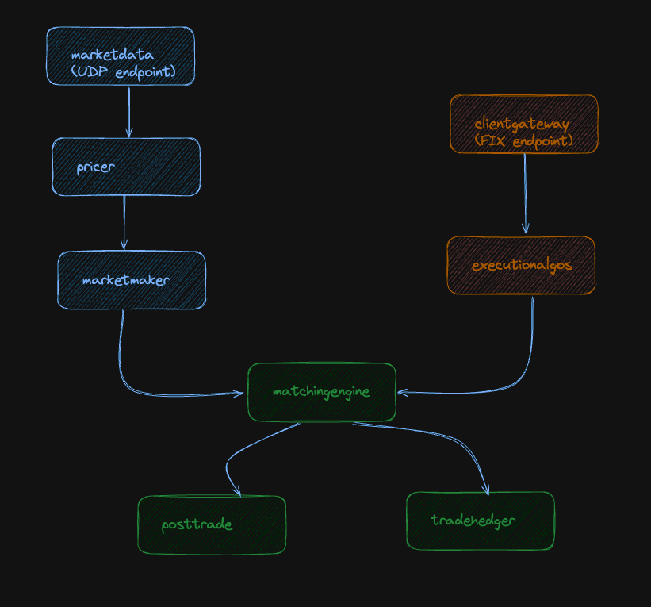
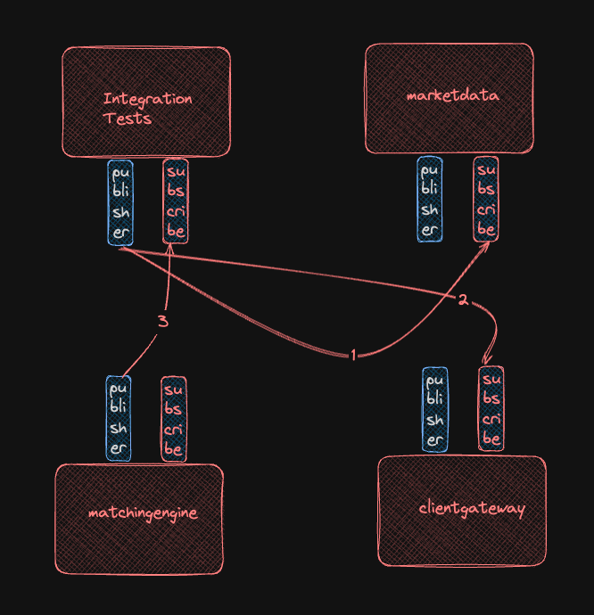
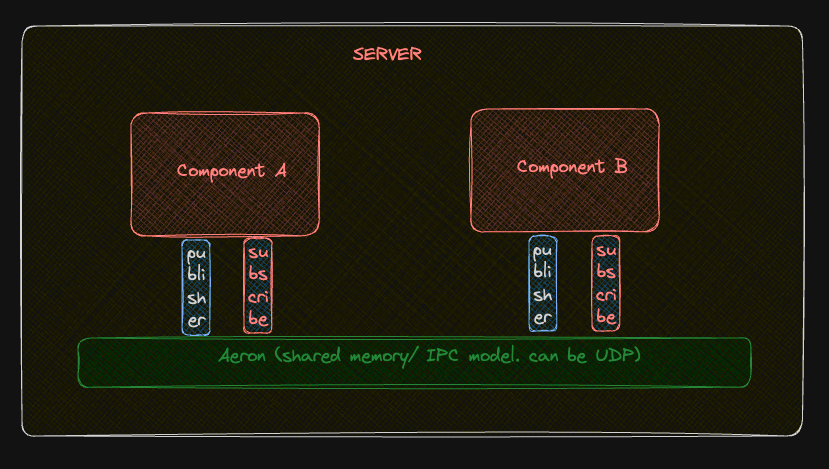

## Algorithmic Trading Simulator: Market Maker + Execution Algos
#### Overview
> A modular simulation of a trading stack: fake market data feeds into a market maker (liquidity provider) and execution algos (large order handling), interacting with a matching engine.
#### Technology Showcased
- Low Latency Java
- Event Driven Architecture
#### Tech Stack
- Java 21
- Aeron: transport layer
- SBE: serialization deserialization
- Agrona: high-performance data structures and utilities library, structured thread execution
- Gradle
#### Modules
MarketData - idea is to send order depth from integration tests
Pricer	Calculates bid/ask spreads (e.g., volatility-adjusted, inventory-aware)
MarketMaker	Posts/manages liquidity (e.g., dynamic order sizing, skew control) and includes position manager
MatchingEngine	Simulates exchange matching (price-time priority, order book updates) - check trades from integration tests
ClientGateway	Handles client orders - send orders from integration tests
Realistic Flow: MarketData → Pricer → MarketMaker → MatchingEngine mirrors production pipelines.
Execution Algos: large-order handling, TWAP, VWAP, iceberg
Extensibility: "Can plug in live data feeds (e.g., Polygon API) or add more algos (e.g., POV)."
#### Ever wondered how market makers and execution algos work under the hood? I built a modular simulator to demystify it: [GitHub Link]. Key takeaways:
How dynamic pricing reacts to volatility.
How execution algos (TWAP/VWAP) slice large orders.
Feedback welcome!



## How to Run
#### For Integration Tests
Embedded Aeron Media Driver started by test case
Each microservice started in its own thread (all Main.java implement Runnable)

#### For Full Deployment
One can configure multiple instances of each microservice through config.yaml

Start media driver first<br>
`cd scripts`<br>
`./run.sh`

Start Microservices<br>
`gradle :clientgateway:run` <br>
`gradle :executionalgos:run` <br>
`gradle :marketdata:run` <br>
`gradle :marketmaker:run` <br>
`gradle :matchingengine:run` <br>
`gradle :pricer:run` <br>

TODO: next, run integration tests which will post market data, and also client orders, to simulate end to end flow, and read back from channels of matching engine to check results of matched trades, or check error channels



## Developers Notes
gradle.properties - just to make Gradle queit<br>
settings.gradle - multi module<br>
root build.gradle - centrally define common configuration, dependencies, configure java plugin, VM args << study carefully<br>
each microservice - Has a Main.java to start microservice, and it reads from common/src/main/resources/dev/config.yaml by default, unless you set env variable ENV=uat etc.<br>
config.yaml - in common project, containing especially Aeron channels and streams, and you can set multiple instances of single microservice, each instance will be a new Agrona thread.<br>
It is configured to be used in build.gradle, so you can start using gradle. <br>
Has a AgentRunner which acts as an event loop repeatedly calling Agent.<br>
Has Agent which is usually a subscriber to Aeron transport, and usually a publisher also.<br>

#### commons ConfigReader.java
```
    ObjectMapper mapper = new ObjectMapper(new YAMLFactory());
    try {
      InputStream input =
          AppConfig.class.getClassLoader().getResourceAsStream(env + "/config.yaml");
      return mapper.readValue(input, AppConfig.class);
    } catch (IOException e) {
      throw new RuntimeException(e);
    }
```

### common java sbe package
Contains auto generated codec files; see common/build.gradle for generateMessages task<br>
`gradle :common:generateMessages`

#### Any Main.java
```
    String env = System.getenv("ENV");
    if (env == null) {
      env = System.getProperty("env", "dev"); // default to dev
    }

    AppConfig configs = ConfigReader.getConfig(env);
    configs.aeron.marketmaker.streams.forEach(
        (config) ->
            new MarketMakerAgentRunner(
                    config.sub_streamId,
                    config.pub_streamId,
                    config.sub_channel,
                    config.pub_channel)
                .start());
```
#### Aeron


You can switch to RPC easily by just changing channel in common config.yaml!
