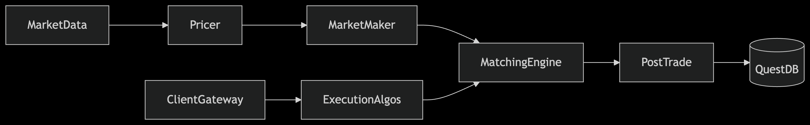

## Algorithmic Trading Simulator: Market Maker + Execution Algos
#### Overview
> A modular simulation of a trading stack: fake market data feeds into a market maker (liquidity provider) and execution algos (large order handling), interacting with a matching engine.
#### Technology Showcased
- Low Latency Java
- Event Driven Architecture
#### Tech Stack
- Java 21
- Aeron
- SBE
- Agrona
- Gradle
#### Modules
MarketData (Fake)	Generates synthetic tick data (e.g., Brownian motion, order book snapshots)
Pricer	Calculates bid/ask spreads (e.g., volatility-adjusted, inventory-aware)
MarketMaker	Posts/manages liquidity (e.g., dynamic order sizing, skew control) and includes position manager
MatchingEngine	Simulates exchange matching (price-time priority, order book updates)
ClientGateway	Handles client orders (e.g., TWAP, VWAP, iceberg)
Realistic Flow: MarketData → Pricer → MarketMaker → MatchingEngine mirrors production pipelines.
Execution Algos: large-order handling (e.g., "How TWAP slices orders to minimize impact").
Extensibility: "Can plug in live data feeds (e.g., Polygon API) or add more algos (e.g., POV)."
#### Ever wondered how market makers and execution algos work under the hood? I built a modular simulator to demystify it: [GitHub Link]. Key takeaways:
How dynamic pricing reacts to volatility.
How execution algos (TWAP/VWAP) slice large orders.
Feedback welcome!

